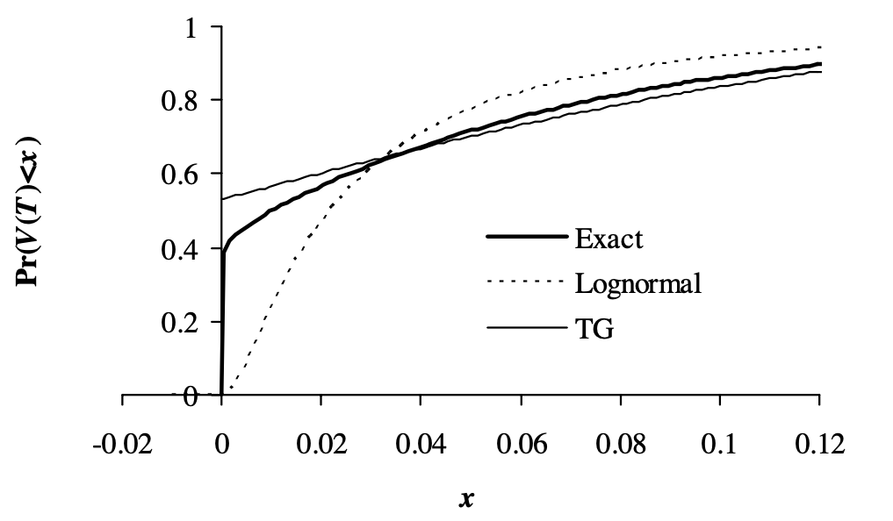
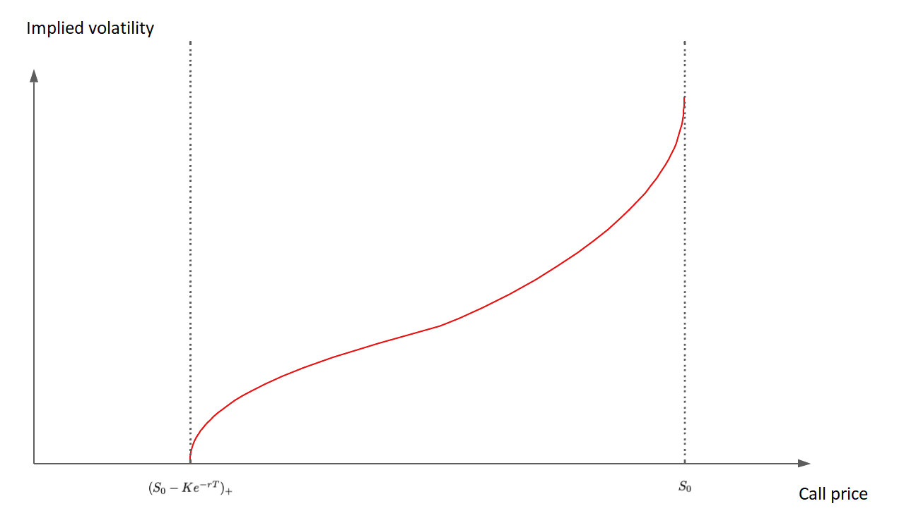

# Simulation_Heston_Stochastic_Volatility_Model
Simulation of the Heston Stochastic Volatility Model based on :

[1] Andersen, L. B. (2007). Efficient simulation of the Heston stochastic volatility model. Available at SSRN 946405.

[2] Van der Stoep, A. W., Grzelak, L. A., & Oosterlee, C. W. (2014). The Heston stochastic-local volatility model: Efficient Monte Carlo simulation. International Journal of Theoretical and Applied Finance, 17(07), 1450045.

## To execute
Execute the following command in folder _Surface volatility from data_ or _Heston model_ if you respectively want to compute the volatility surface based on raw data or if you want to simulate the path from Heston Model.

`g++ *.cpp ../*.cpp -o main`

to create executable file `main` and run it with `./main` in terminal.

# Implied Volatility Surface
In the market, for each asset, we observe a matrix of call prices for a given set of strikes and set of maturities $\{C^{Mkt}(T_i, K_j) \}_{i \in [[ 1, N ]], j  \in [[ 1, N ]]}$. Therefore, we can reverse the implied volatility matrix on the same set of strikes and maturities.

$$
\forall (i,j) \in [[ 1, M ]] \text{x} [[ 1, N ]], \sigma^*(T_i, K_j) = C^{-1}_{T_i, K_j} (C^{Mkt}(T_i, K_j))
$$

Then, we need to interpolate/extrapolate this volatility matrix to be able to request the implied volatility at any maturity and strike.

For each maturity, the volatility smile is often interpolated/extrapolated using natural cubic splines.

The interpolation/extrapolation along maturities has different conventions, but the one we will use is linear interpolation in total variance $(\sigma^*)² (T, K)T$ along a constant forward moneyness like

$$
k_{F_T} = \frac{K}{F_T} = \frac{K}{S_0 e^{\int_{0}^{T} r(s)ds}}
$$

## Interpolation/Extrapolation along the strikes

For each $i \in [[ 1, M ]]$, we call the slice $(\sigma^* (T_i, K))_{K>0}$ the volatility smile at maturity $T_i$. As we only get a few points $\\{ \sigma^* (T_i, K_1), ... , \sigma^* (T_i, K_N) \\}$ from the market option prices, a first intuition would be to perform linear interpolation in between points.

A better idea is then to perform polynomial interpolation in between points as we need the implied volatility surface to be $C^{1,2}$, meaning once-differentiable towards the maturity variable T, and twice-differentiable towards the strike variable K.

Therefore, we use the **Natural Cubic Spline** approach.

Let's call $(x_j = K_j, y_j = \sigma^*(T_i, K_j))_{j \in [[ 1, N ]]}$ the set of points of the smile at maturity $T_i$.

$\forall j \in [[ 1, N-1 ]]$, we consider the cubic polynomial function $S_j$ defined on $[x_j, x_{j+1}]$ by :

$$
S_j(x) = \alpha_j(x - x_j)^3 + \beta_j(x - x_j)^2 + \gamma_j(x - x_j) + \delta_j
$$

The spline interpolation function is therefore the piecewise combination of those cubic polynomials :

$$
\forall K \in [x_1, x_N], \text{ } \sigma^*(T_i, K) = S_j(K) \text{ if } K \in [x_j, x_{j+1}]
$$


Then, we use the conditions at points to find the 4 x (N-1) coefficients $\\{ \alpha_j, \beta_j, \gamma_j, \delta_j \\}$

**Conditions at points $x_j$**

Firstly, let's use the fact that the spline function contains all the points given by the market :

$$
\forall j \in [[ 1, N-1 ]], S_{j} (x_j) = y_{j} \text{ and } S_{j} (x_{j+1}) = y_{j+1}
$$

Which fills 2(N-1) conditions.

Secondly, let's use the $C²$ property of the spline function :

```math
\forall j \in [[ 1, N-1 ]], S^{'}_{j} (x_{j+1}) = S^{'}_{j+1} (x_{j+1}) \text{ and } S^{''}_{j} (x_{j+1}) = S^{''}_{j+1} (x_{j+1})
```

Which completes 2(N-2) conditions as well. Finally, there are 2 conditions left to make the system solvable. The most natural choice is to have **zero second order derivative** at extremities

```math
S^{''}_{1} (x_1) = S^{''}_{N-1} (x_N) = 0
```

**Solving the conditions**

We note $\Delta x_j = x_{j+1} - x_j$, so from the first condition we have

$$
\delta_j = y_j
$$

$$
\alpha_j \Delta x³_j + \beta_j \Delta x²_j + \gamma_j \Delta x_j = y_{j+1} - y_j
$$

And the second condition gives

$$
3 \alpha_j \Delta x²_j + 2 \beta_j \Delta x_j = \gamma_{j+1} - \gamma_{j}
$$

$$
3 \alpha_j \Delta x_j = \beta_{j+1} - \beta_{j}
$$

In addition, the condition on zero second order derivative at extremities gives

$$
\beta_1 = 0
$$

$$
3 \alpha_{N-1} \Delta x_{N-1} + \beta_{N-1} = 0
$$

We can infer

$$
3 \alpha_j \Delta x^2_j = (\beta_{j+1} - \beta_{j}) \Delta x_j
\implies \\
\gamma_{j+1} - \gamma_j = (\beta_{j+1} - \beta_{j}) \Delta x_j
$$

Also, with $\alpha_j = \frac{\beta_{j+1} - \beta_{j}}{3 \Delta x}$

$$
(\beta_{j+1} + 2 \beta_{j}) \Delta x_j + 3 \gamma_j = 3 \frac{y_{j+1} - y_j}{\Delta x_j}
$$

We shift the index $j$ by $j+1$

$$
(\beta_{j+2} + 2 \beta_{j+1}) \Delta x_{j+1} + 3 \gamma_{j+1} = 3 \frac{y_{j+2} - y_{j+1}}{\Delta x_{j+1}}
$$

We obtain

$$
\forall j \in [[ 1, N-3 ]], \beta_{j+2} \Delta x_{j+1} + 2 \beta_{j+1} (\Delta x_{j+1} + \Delta x_j) + \beta_j \Delta x_j = 3 \Bigg( \frac{y_{j+2} - y_{j+1}}{\Delta x_{j+1}} - \frac{y_{j+1} - y_j}{\Delta x_j} \Bigg)
$$

Using conditions $\beta_1 = 0$ and $\alpha_{N-1} = - \frac{\beta_{N-1}}{3 \Delta x_{N-1}}$, we deduce

$$
\Delta x_{N-2} \beta_{N-2} + 2 (\Delta x_{N-2} + \Delta x_{N-1}) \beta_{N-1} = 3 \Bigg( \frac{y_N - y_{N-1}}{\Delta x_{N-1}} - \frac{y_{N-1} - y_{N-2}}{\Delta x_{N-2}} \Bigg)
$$

**Matricial expression for the $\beta_j$**

We can rewrite the two last expressions in a matricial way :

$$
\begin{pmatrix}
  2(\Delta x_1 + \Delta x_2) & \Delta x_2 & 0 & 0 & 0 & 0 & 0\\
  \Delta x_2 & 2(\Delta x_1 + \Delta x_2) & \Delta x_3 & 0 & 0 & 0 & 0\\
  0 & ... & ... & ... & 0 & 0 & 0\\
  0 & 0 & ... & ... & ... & 0 & 0\\
  0 & 0 & 0 & ... & ... & ... & 0\\
  0 & 0 & 0 & 0 & \Delta x_{N-3} & 2 (\Delta x_{N-3} + \Delta x_{N-2}) & \Delta x_{N-2}\\
  0 & 0 & 0 & 0 & 0 & \Delta x_{N-2} & 2 (\Delta x_{N-2} + \Delta x_{N-1})\\
\end{pmatrix}
\begin{pmatrix}
  \beta_2\\
  \beta_3\\
  ...\\
  ...\\
  ...\\
  \beta_{N-2}\\
  \beta_{N-1}\\
\end{pmatrix}
$$

$$
= 3 \text{ x }
\begin{pmatrix}
  \frac{y_3 - y_2}{\Delta x_2} - \frac{y_2 - y_1}{\Delta x_1}\\
  \frac{y_4 - y_3}{\Delta x_3} - \frac{y_3 - y_2}{\Delta x_2}\\
  ...\\
  ...\\
  ...\\
  \frac{y_{N-1} - y_{N-2}}{\Delta x_{N-2}} - \frac{y_{N-2} - y_{N-3}}{\Delta x_{N-3}}\\
  \frac{y_N - y_{N-1}}{\Delta x_{N-1}} - \frac{y_{N-1} - y_{N-2}}{\Delta x_{N-2}}
\end{pmatrix}
$$

Let's denote A the squared tridiagonal symmetrical matrix of dimension (N-2), Z the unknown vector $\\{ Z_1 = \beta_2, ..., Z_{N-2} = \beta_{N-1} \\}$ of size N-2 and $R = \\{ R_1, ..., R_{N-2} \\}$ the right-hand side vector of the equation above.

This system is a typical application of the Thomas decomposition, given A is tridiagonal. The algorithm will be stable due to the fact that A is strictly diagonally dominant with real positive diagonal entries, therefore A is positive definite.

This algorithm allows us to find the coefficients $(\beta_j)$ for all $j \in [[1,N-1]]$, and therefore we can derive the coefficients $(\alpha_j)$ and $(\gamma_j)$ as follows :

$$
\alpha_j  =
\begin{cases}
  \alpha_j = \frac{\beta_{j+1} - \beta_j}{3 \Delta x_j} \text{ if } j \in [[ 1, N-2 ]] \\
  \alpha_{N-1} = - \frac{\beta_{N-1}}{3 \Delta x_{N-1}} \text{ if } j = N-1
\end{cases}
$$

$$
\gamma_j = \frac{y_{j+1} - y_j}{\Delta x_j} - \alpha_j \Delta x²_j - \beta_j \Delta x_j
$$

**Extrapolation along the strike tails**

In the regions $K < K_1$ and $K > K_N$, we make the assumption of linear extrapolation (we prolongate the zero second-order derivative from the extreme points).

We first compute the Left and Right Derivatives:

```math
\begin{cases}
  D_L = S'(x_1) = \gamma_1\\
  D_R = S'_{N-1}(x_N) = 3 \alpha_{N-1} \Delta x²_{N-1} + 2 \beta_{N-1} \Delta x_{N-1} + \gamma_{N-1} 
\end{cases}
```

The extrapolation formula in the tail regions become :

$$
\sigma^* (T_i, K) =
\begin{cases}
  \sigma^* (T_i, K_1) + D_L (K - K_1) \text{ if } K < K_1\\
  \sigma^* (T_i, K_N) + D_R (K - K_N) \text{ if } K > K_N
\end{cases}
$$

## Interpolation/Extrapolation along the maturities

The algorithm below assumes that all M smile functions $( \sigma^{*} (T_i, K))_{K \geq 0}$ have been computed by interpolation/extrapolation for all maturities $\\{ T_1, ..., T_M \\}$ as done in the previous section.

**Interpolation along maturities**

The choice we are making for the interpolation along the maturities is a linear interpolation in variance following constant forward moneyness levels.

For a given maturity $T \in [T_i, T_{i+1}]$ and any strike $K$

1. We compute the forward moneyness level: $k_{F_T} = \frac{K}{F_T} = \frac{K}{S_0} e^{- \int^T_0 r(s) ds}$
2. We extract the strikes $K^{(i)}$ and $K^{(i+1)}$ corresponding to that forward moneyness for maturities $T_i$ and $T_{i+1}$:

```math
K^{(i)} = k_{F_T} \text{ x } S_0 e^{\int^{T_i}_0 r(s) ds}\\
K^{(i+1)} = k_{F_T} \text{ x } S_0 e^{\int^{T_{i+1}}_0 r(s) ds}
```

3. We denote the variance quantity $v(T, k) = (\sigma^{*})² (T,k \text{ x } S_0 e^{\int^T_0 r(s) ds}) \text{ x } T$
4. We get the value $v(T, k_{F_T})$ by linear interpolation of $v(T_i, k_{F_T})$ and $v(T_{i+1}, k_{F_T})$:

$$
v(T, k_{F_T}) = v(T_i, k_{F_T}) + \frac{v(T_{i+1}, k_{F_T}) - v(T_i, k_{F_T})}{T_{i+1} - T_i} \text{ x } (T - T_i)
$$

5. As a summary, the quantity $\sigma^{*}(T, K)$ is therefore computed by the following formula:

```math
\sigma^* (T, K) = \sqrt{\frac{1}{T} \text{ x } \Bigg( ( \sigma^* )² (T_i, K^{(i)})T_i + \frac{( \sigma^* )² (T_{i+1}, K^{(i+1)})T_{i+1} - ( \sigma^* )²-(T_i, K^{(i)})T_i}{T_{i+1} - T_i} (T - T_i) \Bigg)}
```

where

```math
K^{(i)} = K e^{\int^{T_i - T}_0 r(s) ds}\\
K^{(i+1)} = K e^{\int^{T_{i+1} - T}_0 r(s) ds}
```

6. All the quantities above are obtained thanks to the interpolation/extrapolation of all the smile functions at all maturities $(T_i)_{i \in [[ 1, M ]]}$

**Extrapolation along maturities**

The extrapolation of the implied volatility surface outside the range of the market input maturities can be assumed to be constant, still following a same level of forward moneyness from the extreme maturities

```math
\sigma^* (T, K) =
\begin{cases}
  \sigma^* (T_1, K^{(1)}) \text{ if } T < T_1\\
  \sigma^* (T_M, K^{(M)}) \text{ if } T > T_M
\end{cases}
```

where

```math
K^{(1)} = K e^{\int^{T_1 - T}_0 r(s) ds}\\
K^{(M)} = K e^{\int^{T_M - T}_0 r(s) ds}
```

# Simulation in the Heston model

This section is dedicated to the simulation of stochastic processes to model prices and variance in the Heston stochastic volatility model.

The Heston model is defined as follows :

$$
\begin{cases}
  \frac{dX(t)}{X(t)} &= \sqrt{V(t)}dW_{X}(t)
  \\
  dV(t) &= \kappa(\theta - V(t))dt + \epsilon \sqrt{V(t)}dW_{V}(t)
\end{cases}
$$

The price $X(t)$ does not have a drift term as we consider the price to be actualized. The variance process $V(t)$ verifies a Cox-Ingersoll-Ross (CIR) diffusion. The parameters $\kappa$, $\theta$ and $\epsilon$ are strictly positive values. $\theta$ is called the long variance, or long-run average variance of the price (it corresponds to the expected value of $V(t)$ at infinity) ; $\kappa$ is the speed of adjustment to the mean $\theta$, so the rate at which $V(t)$ reverts to $\theta$ and $\epsilon$ represents the volatility of volatility, determining the variance of $V(t)$.

We consider a probability space $(\Omega, \mathcal{F}, \mathbb{P}, (\mathcal{F_{t \geq 0}}))$ and the price process is a $\mathcal{F}$ - $\mathbb{P}$ - martingale.

The conditional law followed by $V(T)|V(t)$ with $T \geq t$ and $t$ fixed is a decentralized $\chi^2$ law. As we know the distribution function of such a law, theoretically, we can simulate a variance process by incrementing from the initial value $V(0)$ and by inverting from the distribution function.

We use discretisation schemas for solving Stochastic Differential Equations (SDE) in the Heston model. Firstly, we simulate the variance process, then we generate the price process to verify the Heston model associated to $V(t)$.

For the sake of simplicity, we prefer to simulate the logarithm of the value of the actualised price process $\log(X(t))$. From the $It\bar{o}$ lemma applied to $log(X(t))$ in the Heston model, we have :

$$
\begin{cases}
  d \log(X(t)) &= -\frac{1}{2} V(t) dt + \sqrt{V(t)} dW_{X}(t)
  \\
  dV(t) &= \kappa(\theta - V(t))dt + \epsilon \sqrt{V(t)}dW_{V}(t)
\end{cases}
$$

## Euler Simulation

We consider subdivisions of the interval $[0, T]$ into subintervals of length  $\frac{T}{N}$ and for $k \in [[ 0, N ]]$ we consider $t_k = \frac{kT}{N}$.

We denote $X^e(t)$ and $V^e(t)$ the approximations of the process $X(t)$ and $V(t)$ by the Euler schema, defined as follows :

$$
\begin{cases}
  \log(X^e(t_{k+1})) &= \log(X^e(t_k)) - \frac{1}{2} V^e(t_k) \frac{T}{N} + \sqrt{V^e(t_k)} Z_X \sqrt{\frac{T}{N}}
  \\
  V^e(t_{k+1}) &= V^e(t_k) + \kappa(\theta - V^e(t_k)) \frac{T}{N} + \epsilon \sqrt{V^e(t_k)} Z_V \sqrt{\frac{T}{N}}
\end{cases}
$$

where the variables $Z_X$ and $Z_V$ follow a reduced centered normal distribution correlated to $\rho$. We simulate those variables by inverting the distribution function and using two independent random processes uniformely distributed.

The positivity of $V^e(t)$ is not guaranteed so the Euler schema may not converge. The framework in the article [1] considers a truncated version of the Euler schema by replacing $V^e(t)$ by $\max(0, V^e(t))$, so we perform it in our implementation.

## QE Simulation



Distribution function for $V(T)|V(0)$ with $T = 0.1$

Parameters : $V(0) == 4%$, $x == 50%$ and $\epsilon == 100%$

The truncated gaussian distribution and the log-normal distribution have been calibrated from moments of the exact distribution of $V(T)$. [1]

The log-normal distribution underestimates the weight around the origin $V(0)$ of the distribution $(V(t))_{t \in [[ 0,T ]]}$ while the truncated gaussian distribution overestimates this weight.

Furthermore, the density function of the decentralized $\chi^2$ law is determined :

$$
f_{\chi²}(x;v) = \frac{1}{2^\frac{\nu}{2} \Gamma (\frac{\nu}{2})} e^{- \frac{x}{2}} x^{\frac{\nu}{2} - 1}
$$

We obtain an approximation of the variance process at time $t_{k+1}$ by the squared value of a gaussian process calibrated from the moments of the variance process simulated between $0$ and $t_k$. This approximation is not optimal when the value of the variance process at time $t_k$ is small. To address this issue, the QE schema propose a simulation of $V^{qe}(t_{k+1})$ depending of the value $V^{qe}(t_k)$. Therefore, we prefer this schema in our implementation. We have :

* For great values of $V^{qe}(t_k)$ : $V^{qe}(t_{k+1}) =  a(b+Z_V)²$, $a$ and $b$ calibrated from the determined formulas of the conditional expectation and conditional variance of $V^{qe}(t_k)|V^e(0)$.
* For small values of $V^{qe}(t_k)$ : we simulate $V^{qe}(t_ {k+1})$ following the density $\mu \delta(0) + \beta(1 - \mu)(- \beta(\cdot))$ defined on $[0, + \infty]$, with $\mu$ and $\beta$ calibrated from the determined formulas of the conditional expectation and conditional variance of $V^{qe}(t_k)|V^e(0)$.

In our implementation, we consider a simulation with gaussian process in case the following condition is fulfilled :

$$
\psi_c := \frac{Var(V(t_k)|V(0))²}{\mathbb{E}[V(t_k)|V(0)]²} \leq \frac{3}{2}
$$

If not, we use the second method for the simulation.

Once the simulation of the variance process is done, we use the discretisation schema of the price proposed in [1] :

$$
\log(X^{qe}(t_{k+1})) = \log(X^{qe}(t_k)) + \frac{\rho}{\epsilon}(V^{qe}(t_{k+1}) - V^{qe}(t_k) - \kappa \theta \frac{T}{N}) + \frac{T}{N} (\frac{\kappa \rho}{\epsilon} - \frac{1}{2}) (\gamma_1 V^{qe}(t_k) - \gamma_2  V^{qe}(t_{k+1})) + \sqrt{\frac{T}{N}}  \sqrt{1 - \Bigl( \frac{T}{N} \Bigl) ²} \sqrt{\gamma_1 V^{qe}(t_k) + \gamma_2 V^{qe}(t_{k+1})} \cdot Z
$$

where $\gamma_1 = \gamma_2 = \frac{1}{2}$ or $\gamma_1 = 1$ and $\gamma_2 = 0$.

***In the paper, a martingale correction is proposed. A further version of this projet will implement it. The martingale correction consists in generating a martingale process in the QE simulation which enable to have consistant prices regarding the prices observed on the market***

Other simulation methods are also implemented in the paper : the Kahl-Jackel schema, the Broadie-Kaya schema, but not implemented here yet.

# Monte-Carlo pricer and greeks simulations

## Monte-Carlo pricer and variance reduction method

We want our Monte-Carlo pricer to simulate the prices quickly and with the minimum variance possible. Variance reduction is important for the precision of the prices computed. An extreme case corresponds to the computation of prices which are strongly in/out of the Money for the computation an implied volatility. For a call Outside of The Money (OTM), the Vega is barely uniformely equal to 0 and so the derivative of the implied volatility with respect to the price is very high, as it tends to infinity.



The plot of the implied volatility shows that for an OTM call, its price is closed to the bounds. The sensitivity of the implied volatility to the price of the call is therefore very high, so the computation requires a very high precision as well (i.e a low variance) to compute correctly the implied volatility. Those computations of the implied volatility OTM are necessary if we want to compute the volatility surface over a great amount of strikes, without having to extrapolate a calibration nearby the Money.

### Pricing method by parity call-put

A first method to reduce the variance consists in using the call-put parity to price in the direction of the minimum variance, which is performed by the method *call_price_auto* from the class _HestonQECallPricer_. Theoretically, we look at pricing from the call when the option is In The Money (ITM) and from the put when the option is OTM, in order to prevent that the support of the greatest probability corresponds to the null part of the payoff.

### Pricing method by unbiased regression

This method consits in using the relationship $Z = (S_T - K)_+ - b(S_T - e^{rT}S_0)$ where $S_T$ is a martingale under risk neutral probability, where the expectation and variance of $Z$ are :

```math
\begin{cases}
\mathbb{E}[Z] &= \mathbb{E}[(S_T - K)_+]
\\
Var(Z) &= Var((S_T - K)_+) + b² Var(S_T) - 2 b Cov((S_T - K)_+, S_T)
\end{cases}
```

We optimize those expressions with respect to $b$, so we obtain :

```math
b^* = \frac{Cov((S_T - K)_+, S_T)}{Var(S_T)} \implies
Var(Z)^* = Var((S_T - K)_+)(1 - \sigma_{(S_T - K)_+, S_T})
```

We need the expressions for $Cov((S_T - K)_+, S_T)$ and $Var(S_T)$. For this, we use an independent sample for the computation of $b^*$ to avoid the introduction of a bias in the price of the call. This is implemented in the method *call_price_regression* of the class _HestonQECallPricer_.

In addition, we use the library _OpenMP_ for the distribution of the computation and the parallelisation of the code.

## Computation of greeks

The computation of greeks is central for the calibration of a volatility surface on the market. The major part of optimisation methods use a gradient descent method to optimise a loss function. For $x$ the vector of parameters of the Heston model, the loss function $L$ is given by :

$$
L(x) = \sum^N_{i=1} (\sigma_{impli}(C_i(x)) - \sigma^*_i)²
$$

Then, the gradient of the loss function is :

```math
\nabla L(x) = \sum^N_{i=1} 2 (\sigma_{impli}(C_i(x)) - \sigma^*_i) \frac{d \sigma_{impli}}{dC} \nabla_x C
```

It is necessary to correctly compute the gradient of the greeks, i.e with the minimum variance to guarantee the convergence of the optimisation algorithm.

### Centered finite differences (arbitrage between truncation error and variance)

The first method consists to use the centered finite difference method $\partial_i C(x) \approx \frac{C(x+h_i) - C(x-h_i)}{2h_i}$. The major issue with this method to simulate the function is the existence of an arbitrage between the truncation error and the variance. As we use correlated random variables to simulate $C(x+h_i)$ and $C(x-h_i)$, we have :

$$
Var(\partial_i C(x) = \frac{Var(C(x+h_i)) + Var(C(x-h_i))}{4h²_i}) \approx \frac{1}{2h²_i} Var(C(x))
$$

So the variance reduces with higher values of $h_i$, and the truncation error is proportional to $h²_i$, so we have a trade-off between those two. We need to simultaneously augment the number of points and reduce the value of $h_i$ to reach a good precision, which is very expensive. Those methods are implemented in the class _HestonGreekDiff_.

### Automatic differentiation

Automatic differentiation is a technique of numerical differentiation to remove the truncation error by explicitly expressing all the derivatives. For $x$ the vector of parameters in the Heston model, the price of the call is :

$$
C(x)=\mathbb{E}[e^{rT}(S_T(x)-K)_+]
$$

The option price $S_T$ has a null mass function and $x \longmapsto (S_T(x)-K)_+$ is continuous, so locally bounded, so on intervals we obtain :

$$
\partial_j C(x) = \mathbb{E}[e^{-rT} \partial_j S_T \mathbb{1}_{(S_T - K)_+ > 0}]
\\
\implies \partial_j \hat{C}(x) = \frac{1}{N} \sum^N_{i=1} e^{rT} \partial_j S^i_T(x) \mathbb{1}_{(S^i_T - K)_+ > 0}
$$

$S^i_T(x)$ is simulated by :

$$
S_{t_{i+1}}(x) = G(x, S_{t_i}(x), V_{t_{i+1}}(x), V_{t_i}(x))
$$

with $G$ the chosen schema. It is possible to derive the identities for each step of the schema by using the chain rule, and then have a schema for $\partial_j S_T(x)$.

$$
\partial_j S_{t_{i+1}}(x) = \partial_1 G + \partial_j S_{t_i}(x) \partial_2 G + \partial_j V_{t_{i+1}}(x) \partial_3 G + \partial_j V_{t_i}(x) \partial_4 G
$$

The automatic differentiation consists in the diffusion of $(S_t(x), \nabla_x S_t(x), V_t(x), \nabla_x V_t(x)$ with the chosen schema. This method are implemented through the classes _HestonQEHelper_ and _PointSimulatorHestonQE_.

The class _HestonQEHelper_ contains all the methods to compute the explicit derivatives and the class _PointSimulatorHestonQE_ contains the method *multi_state_simulation_multi_thread* to diffuse $(S_t(x), \nabla_x S_t(x), V_t(x), \nabla_x V_t(x)$. After several tests, this schema seems unstable as we obtain diverging gradients. We did not find literature on the stability of those methods, so it might be unstable intrinsically. **Code needs to be reviewed and analytical computations as well**.

## Constraints optimization

The calibration of the implied volatility surface is a constraints optimization problem and can be expressed as a convex optimization problem :

$$
(P) : \inf_{v \in K} L(v)
$$

where $L(\cdot)$ is the convex cost function from previous section and $K$ is the convex defined by :

$$
K := \\{ v \in \mathbb{R}^4 | v_1 \geq 0, v_2 \geq 0, v_3 \geq 0, -1 \leq v_4 \leq 1, v²_3 - 2 v_1 v_2 \leq 0 \\}
$$

$K$ is convex by the intersection of convex half-spaces.

### Projected gradient algorithm

A first method is to use the projected gradient algorithm defined by :

$$
u^{k+1} = \mathbb{P}
_K(u^k - \rho^k r^k)
$$

where $\rho^k$ is the residual at step $k$ such as $\rho^k = \nabla L(u^k)$ and $\mathbb{P}_K$ is the projection on the closed convex $K$.

Under conditions of convexity and differentiability, if $\nabla L$ is uniformly Lipschitz, then the projected gradient descent converges to the optimal solution if and only if the parameter $\rho^k$ is bounded by the parameters of the model.

The condition of non-linearity induced by the CIR process prevents us to give an explicit formula for the projection operator $K$, as it requires a process with positive variance. Therefore, the non-linearity condition implies the gradient descent to have bad performances as the projection of the variables are on the bounds of the cone.

### Saddle point theory and Usawa algorithm

Then, the second method chosen uses the theory of the saddle point and the Usawa algorithm.

It requires the dual form of the convex optimization problem. Let $\mathcal{L}(\cdot)$ be the Lagrangian operator. The Lagrangian of $(P)$ is given by :

$$
\inf_{v \in \mathbb{R}⁴} \mathcal{L}(v, \lambda) = \mathcal{L}(v) + <\lambda, F(v)>
$$

where $F(\cdot)$ is the application defined by the constraints of the primal formula.

In this new optimization problem, we look for a saddle point of $\mathcal{L}(\cdot)$ and we have $\lambda > 0$. Therefore, the optimization problem under the dual form is a simpler problem than the previous one. The primal form requires a solution in the non-trivial convex space $K$ while the dual form has a solution on a simple half-space where the projection operator can be characterized trivially. The projected gradient algorithm is more adapted in this context. The process consists of the following steps :

* We compute $g(\lambda) = \inf_{v} \mathcal{L}(v, \lambda)$. $\mathcal{L}(\cdot)$ being convex, the optimal conditions are when its gradient is equal to 0 (Euler condition). We can find it by simple gradient descent.
* Once $v_{\lambda}$ is computed, we consider $g(\cdot)$ and we minimise $- g(\cdot)$ by applying the projected gradient on the half-space $\mathbb{R}^4_+$. Once $\lambda^*$ is computed, the quantity is injected in the formula of $x_{\lambda}$.

The result is denoted $x^*$. The gradient of the Lagrangian is given by :

$$
\nabla_v \mathcal{L}(v, p) = \nabla_v \mathcal{L}(v) + \nabla_v <p, F(v)>
$$

with

$$
\nabla_v <p, F(v)> =
\begin{Bmatrix}
  -p_1
  \\
  -p_2
  \\
  -p_3
  \\
  p_4
  \\
  -p_4
  \\
  -2v_2p_1 - 2v_1p_2 + 2v_3p_3
\end{Bmatrix}
$$

The Usawa algorithm is implemented in the class _CalibrateHestonModel_.

# Description of the files & folder
- class_Matrix_header.h & class_Matrix.cpp: files containing the definition of matrix class and usual operations. Contains methods to perform Cholesky decomposition, (reduced) row echelon matrix transformation and algorithm to solve a Thomas system

- folder _Surface volatility from data_ : Folder containing the build of implied volatility surface
  - class_surface_vol_header.h & class_surface_vol.cpp: files containing the observation of volatility surface
  - class_tenor_cubicspline_header.h & class_tenor_cubicspline.cpp: files containing the interpolation/extrapolation along strikes and maturities as describe above using tenor cubicspline method
  - main.cpp: main file to compile which builds the implied volatility surface
  - folder data : folder containing raw data to observe
    - option_implied_vol.csv
    - option_prices.csv
    - tenor_vol_chain.csv
    - test_vol_curve.csv

- folder _Heston Model_ : Folder containing the simulation of the Heston model and its dependencies
  - class_Random_header.h & class_Random.cpp: files containing the definition of uniform and gaussian random variables
  - class_Model2F_header.h & class_Model2F.cpp: files containing the general definition of a 2 Factor model
  - class_PathSimulatorEuler2F_header.h & class_PathSimulatorEuler2F.cpp: files containing the definition of path simulator via Euler method for a 2 Factor model
  - class_HestonModel_header.h & class_HestonModel.cpp: files containing the definition of Heston model
  - main.cpp: main file to simulate the Heston model
